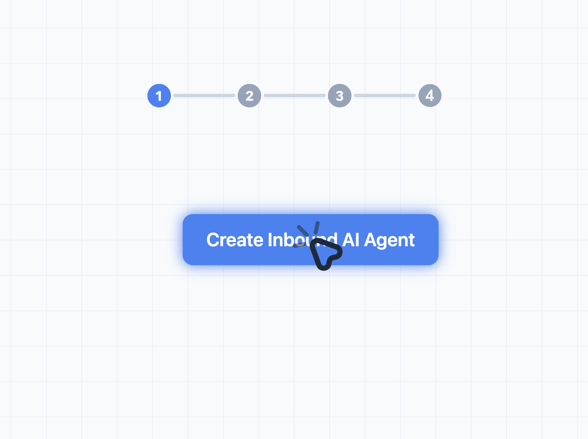

# SVG Interactive Animation Engine

*Born out of necessity, this library was originally created to build animated assets and interactive product walkthroughs for **[Whatsapp CRM](https://thechatquotient.com/)** & **[Daily Standup Meeting Bot](https://www.usestrova.com/)**. Traditional animation tools can be expensive and carry a steep learning curve. Instead of investing countless hours and resources, I collaborated with Google Gemini to engineer a lightweight, purely SVG-based solution. The result was so effective that I decided to abstract the core logic into this reusable, open-source engine.*

*Now, anyone can download this library and empower their AI coding agent to generate beautiful, interactive SVG walkthroughs with ease!*

<div align="center">
  <a href="https://asachanfbd.github.io/svg-animations-agent/sample.html" target="_blank">
    
  </a>
  <p><em>Click the image above to view the live interactive demo!</em></p>
</div>

## Installation

### Via NPM (Recommended for React, Vue, Next.js)

```bash
npm install svg-interactive-animation-engine
```

```javascript
import AnimationManager from 'svg-interactive-animation-engine';
```

### Via CDN / Script Tag (For Vanilla HTML)

Download `svg_animations.js` and include it directly in your HTML:

```html
<script src="svg_animations.js"></script>
```

*(When included via a script tag, `AnimationManager` is automatically attached to the global `window` object.)*

## Overview

This engine provides a robust 60FPS `requestAnimationFrame` loop that manipulates SVG attributes and CSS properties directly based on declarative timeline arrays. It features an event-driven architecture that allows you to chain multiple timelines together, pause for interactions, and trigger parallel layer animations.

## Core Concepts

### 1. The `AnimationManager`
The global orchestrator. It manages the central update loop and calculates `deltaTime` for smooth, framerate-independent rendering.

```javascript
// Initialize the manager targeting your main SVG container
const manager = new AnimationManager('animated-svg');
manager.start();
```

### 2. The `Layer`
A wrapper around a specific DOM/SVG element. Each layer maintains its own independent timeline sequence, state (transformations, opacity), and an event emitter.

```javascript
// Create a layer targeting an SVG <g> or <path> by its ID
const myLayer = manager.createLayer('my-layer-name', '#element-id');
```

## Creating Timelines

Timelines are defined as an array of step objects. A step either executes a set of parallel animations over a `duration` (in milliseconds) or emits an event.

```javascript
const sequence = [
    // Step 1: Move and Fade simultaneously over 1000ms
    { 
        animations: [
            { type: 'move', startX: 0, endX: 100, startY: 0, endY: 50 },
            { type: 'fade', startOpacity: 0, endOpacity: 1 }
        ], 
        duration: 1000 
    },
    // Step 2: Pause for 500ms
    { animations: [], duration: 500 },
    // Step 3: Emit an event to trigger other layers
    { type: 'emit', event: 'step-completed' }
];

myLayer.setSequence(sequence, false).start();
```

## Supported Animations

| Type | Configuration Properties | Description |
|---|---|---|
| `move` | `startX`, `endX`, `startY`, `endY` | Translates the element (in px). |
| `fade` | `startOpacity`, `endOpacity` | Animates the `opacity` CSS property. |
| `scale` | `startScale`, `endScale` (or `X`/`Y` variants) | Uniform or non-uniform scaling relative to `(0,0)`. |
| `rotate` | `startAngle`, `endAngle` | Rotates the element (in degrees). |
| `type` | `text` | A typewriter effect that animates `textContent` over the duration. |

*Note: For scaling or rotating from a specific origin, wrap your SVG element in a `<g>` tag and apply structural translations, or use native SVG `transform` grouping.*

## Event-Driven Orchestration

Because complex prototypes have non-linear timelines (e.g., waiting for an artificial click), the engine uses an Event Bus to coordinate layers.

When a layer hits an `emit` step, you can listen for it and start animations on entirely different layers:

```javascript
const cursorLayer = manager.createLayer('cursor', '#cursor-svg');
const buttonLayer = manager.createLayer('button', '#btn-svg');

// Cursor timeline
cursorLayer.setSequence([
    { animations: [{ type: 'move', startX: 0, endX: 200, startY: 0, endY: 200 }], duration: 1000 },
    { type: 'emit', event: 'clicked-button' }
]).start();

// Listen for the cursor's event to react
cursorLayer.on('clicked-button', () => {
    // Shrink the button to simulate a click
    buttonLayer.setSequence([
        { animations: [{ type: 'scale', startScale: 1, endScale: 0.9 }], duration: 100 },
        { animations: [{ type: 'scale', startScale: 0.9, endScale: 1 }], duration: 100 }
    ]).start();
});
```

## Custom Updates (Advanced)

If you need programmatic control (like an infinitely scrolling background grid), you can bypass sequences and use a `setCustomUpdate` hook:

```javascript
const gridLayer = manager.createLayer('grid', '#bg-grid');

gridLayer.setCustomUpdate((layer, deltaTime) => {
    // Manually calculate infinite panning
    layer.state.offset = (layer.state.offset || 0) - (deltaTime / 1000) * 15;
    if (layer.state.offset <= -40) layer.state.offset = 0;
    
    // Apply changes directly to the DOM element
    layer.element.setAttribute('transform', `translate(${layer.state.offset}, ${layer.state.offset})`);
});

gridLayer.start();
```

## Troubleshooting
- **Animations not applying?** Ensure your target elements do not have CSS `style="transform: ..."` attributes applied inline. Inline CSS will override the native SVG `transform` attributes generated by `layer.applyState()`.
- **Scale looking weird?** SVGs scale from the `(0,0)` coordinate of their immediate parent coordinate system. Ensure your paths are drawn relative to `0,0` or wrapped in appropriate translate groups.
